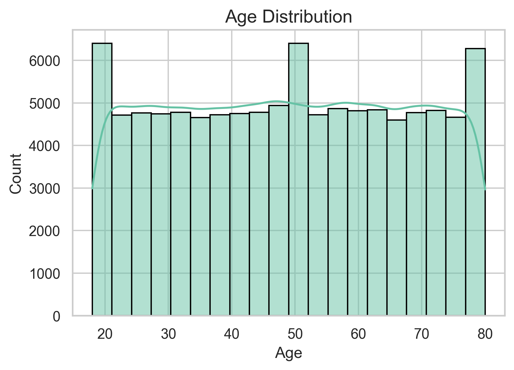
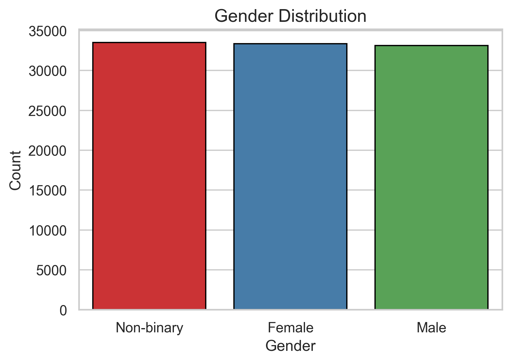
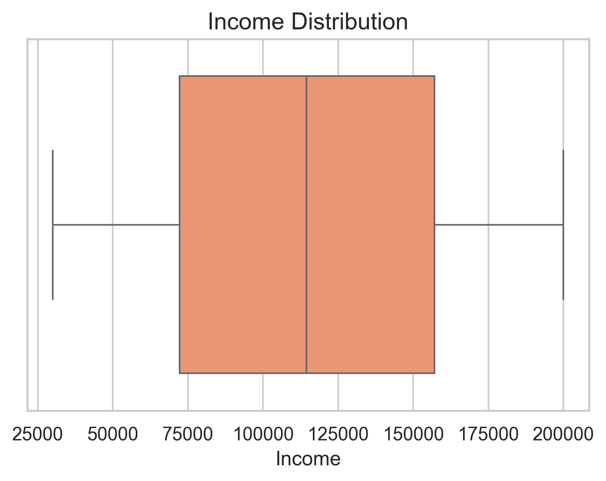
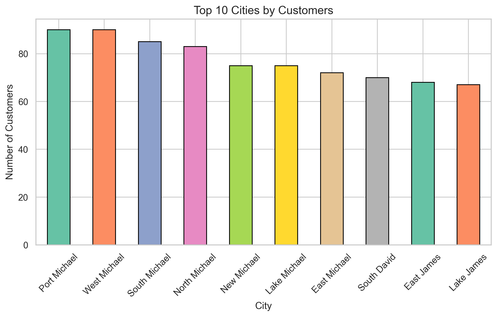
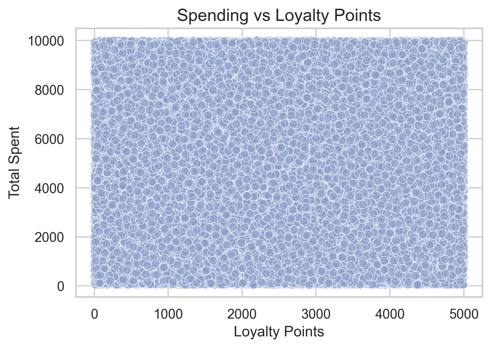
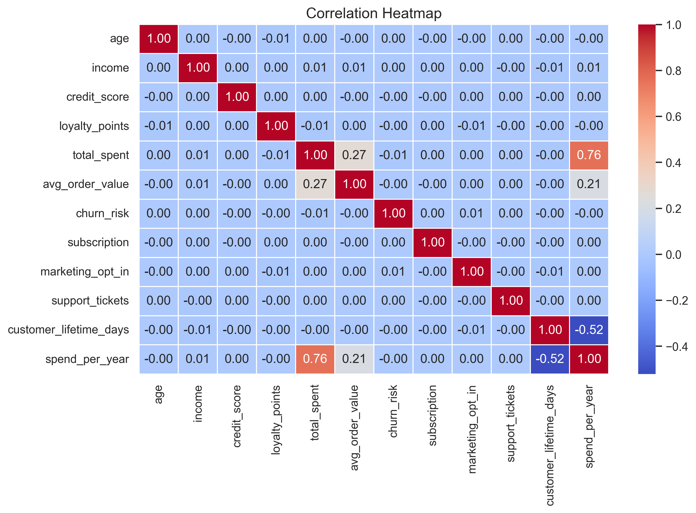
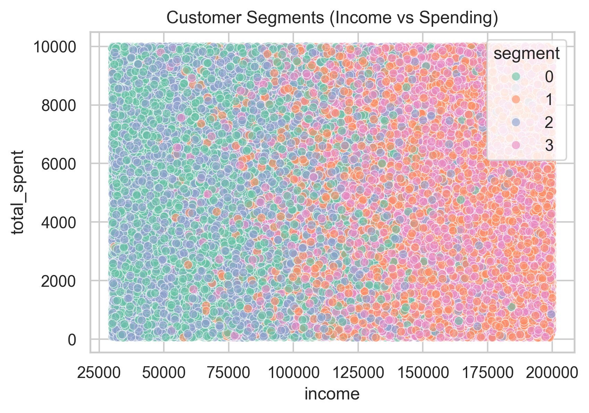
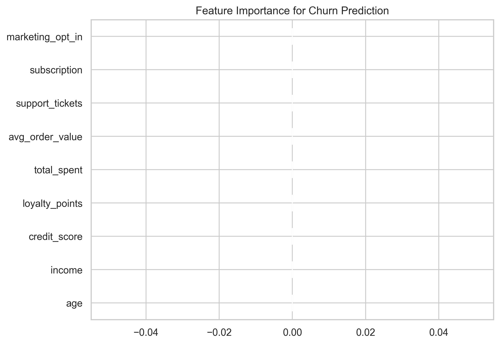

# 🛒 Customer Analytics & Churn Prediction

## 📌 Project Overview

This project focuses on *analyzing customer behavior* and building a *churn prediction model* using a synthetic customer dataset.  
The goal is to:

* Explore customer demographics & spending patterns  
* Segment customers into meaningful groups  
* Predict churn risk using machine learning  
* Provide actionable business insights  

---

## 📊 Dataset

* **Rows**: ~10,000  
* **Columns**: 22  
* **Features**:  
  * **Demographics** → age, gender, income  
  * **Behavior** → loyalty_points, total_spent, avg_order_value, support_tickets  
  * **Engagement** → subscription, marketing_opt_in  
  * **Dates** → first_purchase_date, last_purchase_date  
  * **Target** → churn_risk  

---

## 🔍 Steps in the Notebook

### 1. Data Cleaning & Preprocessing
* Handled missing values, duplicates, outliers  
* Engineered new features (`customer_lifetime_days`, `spend_per_year`)  

---

### 2. Exploratory Data Analysis (EDA)

We explored demographics and customer behavior to understand trends:

- **Age distribution**  


- **Gender distribution**  


- **Income distribution**  


- **Top 10 cities by customers**  


- **Spending vs Loyalty Points relationship**  


- **Correlation heatmap of features**  


---

### 3. Customer Segmentation (K-Means Clustering)

We clustered customers into **4 groups** based on income and spending.  

**Cluster Visualization**  


---

### 4. Churn Prediction (Random Forest Classifier)

A machine learning model was built to predict churn risk:  

* Train-test split: 70-30  
* Model: Random Forest Classifier  
* Evaluation: precision, recall, F1-score  

**Feature Importance for Churn Prediction**  


---

### 5. Business Insights & Recommendations

* High-income, high-loyalty customers → **retain with premium offers**  
* Low-income, high-churn customers → **targeted retention campaigns**  
* Segment-based churn analysis → **personalized strategies**  

---

## 🛠 Tech Stack

* **Python** → pandas, numpy, matplotlib, seaborn, scikit-learn  
* **Jupyter Notebook** → analysis & visualization  

---

## 📈 Results

* Achieved a **Random Forest churn prediction model**  
* Identified top features influencing churn:  
  * Loyalty points  
  * Total spent  
  * Subscription status  

---

## 🚀 Next Steps

* Deploy churn model via **Flask/FastAPI**  
* Build interactive **dashboard** (Streamlit / Power BI / Tableau)  
* Extend analysis with **real-world customer data**  

---

## 📂 Repository Structure

```

synthetic-customer-data/
│── synthetic\_customers.csv
│── synthetic\_customers\_metadata.json
│── synthetic\_customers\_polished.ipynb
│── output/
│── images/
│   ├── age\_distribution.png
│   ├── gender\_distribution.png
│   ├── income\_distribution.png
│   ├── top\_10\_cities\_by\_customerspng.png
│   ├── spending\_vs\_loyalty\_points.png
│   ├── correlation\_heatmap.png
│   ├── customer\_segments\_(income\_vs\_spending.png
│   ├── feature\_importance\_for\_churn\_prediction.png
│── README.md
│── .gitignore

```

---

---

✍️ *Author: Aayush Shah*  
📧 *Contact*: shahaayush604@gmail.com
📅 *Generated on: November 2023 (Synthetic Dataset)*
